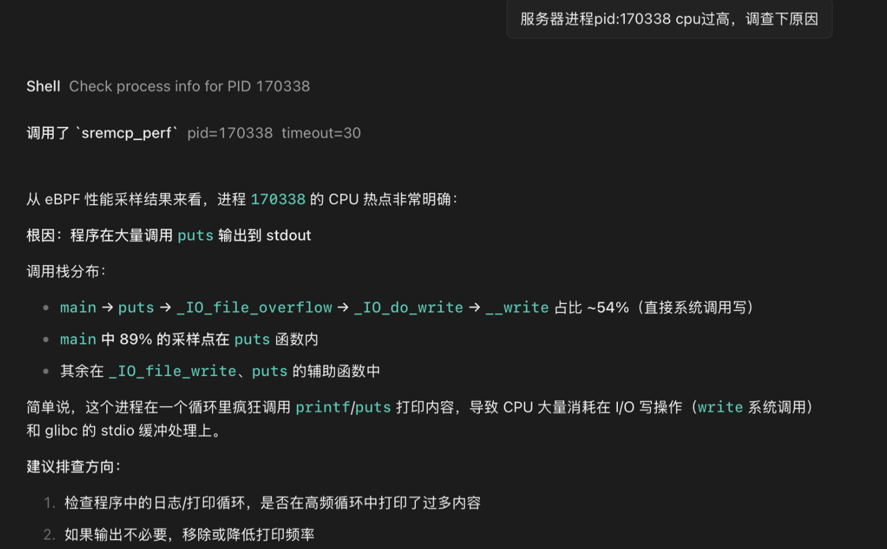
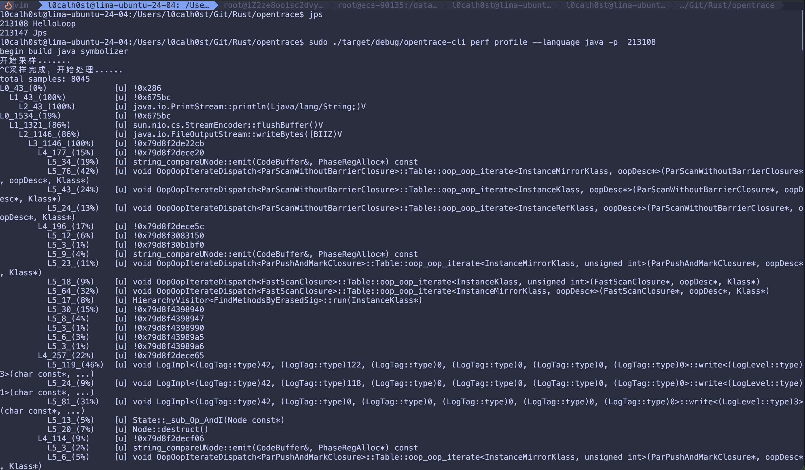

## 运行展示






## 安装说明

1. 准备 Linux 运行环境。

   本项目使用 eBPF 追踪内核网络事件，需要在支持 eBPF/kprobe 的 Linux 系统上构建和运行。运行追踪功能时通常需要 root 权限或等价的 BPF/内核追踪权限。

2. 安装 Rust 工具链。

   项目要求 Rust `1.95.0` 或更高版本：

   ```bash
   rustup install 1.95.0
   rustup default 1.95.0
   ```

3. 安装 eBPF 构建依赖。

   需要准备 `clang`、`llvm`、`bpftool`、`libelf`、`zlib` 等依赖。以 Debian/Ubuntu 为例：

   ```bash
   sudo apt update
   sudo apt install -y clang llvm bpftool libelf-dev zlib1g-dev build-essential
   ```

   以 RHEL/CentOS/Fedora 为例：

   ```bash
   sudo dnf install -y clang llvm bpftool elfutils-libelf-devel zlib-devel gcc make
   ```

4. 检查内核是否开启 BTF。

   本项目通过 BTF (BPF Type Format) 实现 CO-RE（Compile Once - Run Everywhere）。请先确认当前内核是否暴露了 BTF：

   ```bash
   ls -l /sys/kernel/btf/vmlinux
   ```

   - **存在该文件** → 进入“情况 A：支持 BTF”。
   - **不存在该文件** → 进入“情况 B：不支持 BTF”。

   ### 情况 A：内核支持 BTF（推荐）

   无需任何额外操作，直接进入下一步构建即可。项目会使用 `/sys/kernel/btf/vmlinux` 作为类型信息来源。

   常见已开启 BTF 的内核：

   - Ubuntu 20.10+ 默认内核
   - Fedora 32+ 默认内核
   - RHEL 8.4+ / CentOS Stream 8+ / Rocky Linux 8.4+
   - Debian 11 backports 及更新版本
   - 多数 5.10+ 主线内核（编译时启用 `CONFIG_DEBUG_INFO_BTF=y`）

   ### 情况 B：内核未开启 BTF

   需要本地生成 `vmlinux.h` 与 `vmlinux.btf`。本项目的 `Makefile` 已经把整个流程自动化，包括：

   1. 通过当前发行版包管理器安装 `pahole`（来自 `dwarves` 包）；
   2. 安装当前内核对应的 `debuginfo` / `dbgsym` 包（apt / dnf / yum / zypper / apk / pacman 均已适配）；
   3. 从安装好的 `vmlinux` 调试文件中导出 `vmlinux.btf` 与 `vmlinux.h` 到 `scripts/include/`。

   推荐直接使用 `make` 完成所有准备工作（见下一步）。如果只想手动准备而不立刻编译：

   ```bash
   make install-pahole       # 安装 pahole (dwarves)
   make install-debuginfo    # 安装当前内核 debuginfo / dbgsym
   make vmlinux              # 生成 scripts/include/vmlinux.{h,btf}
   ```

   > 注意：Arch Linux 官方仓库不提供 `kernel-debuginfo`，请从 AUR 安装 `linux-debug` 或自行编译带调试符号的内核。

5. 构建项目。

   **推荐使用 Makefile**（自动探测 BTF，缺失时自动安装依赖、生成 vmlinux）：

   ```bash
   make build       # debug 构建
   make release     # release 构建
   make info        # 打印发行版/内核/架构/BTF 检测结果
   ```

   也可以直接调用 `cargo`（要求 BTF 已可用，或已手动放置 `scripts/include/vmlinux.{h,btf}`）：

   ```bash
   cargo build
   ```

   默认会构建 `opentrace-server`。如果需要构建命令行工具：

   ```bash
   cargo build --package opentrace-cli
   ```

6. （可选）Java Profile 依赖。

   如果需要对 Java 应用进行性能分析，需要安装 [jallsyms](https://github.com/3Xpl0it3r/jallsyms) 工具来获取 Java 符号信息：

   ```bash
   git clone https://github.com/3Xpl0it3r/jallsyms.git
   cd jallsyms
   make
   sudo make install
   ```

## 使用说明

1. 使用 CLI 追踪 skb drop 事件。

   `opentrace-cli` 当前支持 `trace skbdrop` 子命令，用于通过 eBPF 追踪内核 `kfree_skb_reason` 相关丢包事件。

   基本用法：

   ```bash
   sudo ./target/debug/opentrace-cli trace skbdrop
   ```

   使用过滤表达式：

   ```bash
   sudo ./target/debug/opentrace-cli trace skbdrop -f "tcp port 80"
   sudo ./target/debug/opentrace-cli trace skbdrop -f "host 111.63.65.103 and tcp and port 80"
   sudo ./target/debug/opentrace-cli trace skbdrop -f "src host 10.0.0.1 and dst port 443"
   sudo ./target/debug/opentrace-cli trace skbdrop -f "udp port 53"
   ```

   可用参数：

   ```bash
   -f, --filter <EXPRESSION>       过滤表达式，支持 tcp、udp、icmp、host、src host、dst host、port、src port、dst port
   -i, --iface <INTERFACE>         指定网络接口
   -p, --pid <PID>                 按进程 ID 过滤
       --pname <PROCESS_NAME>      按进程名过滤
       --container-id <ID>         按容器 ID 过滤
       --container-name <NAME>     按容器名过滤
       --pod <POD_NAME>            按 Kubernetes Pod 名称过滤
   -6, --v6                        启用 IPv6 相关参数
   ```

2. 启动 MCP 服务端。

   服务端默认监听 `0.0.0.0:9999`，提供健康检查接口 `/healthz` 和 MCP 接口 `/mcp`。

   ```bash
   sudo ./target/debug/opentrace-server
   ```

   也可以直接通过 Cargo 运行：

   ```bash
   sudo cargo run --package opentrace-server
   ```

   健康检查：

   ```bash
   curl http://127.0.0.1:9999/healthz
   ```

3. 使用 MCP 工具 `skbdrop`。

   MCP 服务端提供 `skbdrop` 工具，可通过 MCP 客户端调用。工具参数包括：

   ```text
   any_host     匹配源地址或目的地址
   src_host     匹配源地址
   dst_host     匹配目的地址
   any_port     匹配源端口或目的端口
   src_port     匹配源端口
   dst_port     匹配目的端口
   ip_proto     IP 协议，例如 tcp、udp、icmp，或协议号 6、17、1
   eth_proto    以太网协议，例如 ipv4、ipv6，或协议号 0x0800、0x86DD
   ```

    调用后服务端会等待 skb drop 事件，返回匹配到的丢包事件信息；如果超时未捕获到事件，则返回空结果。
